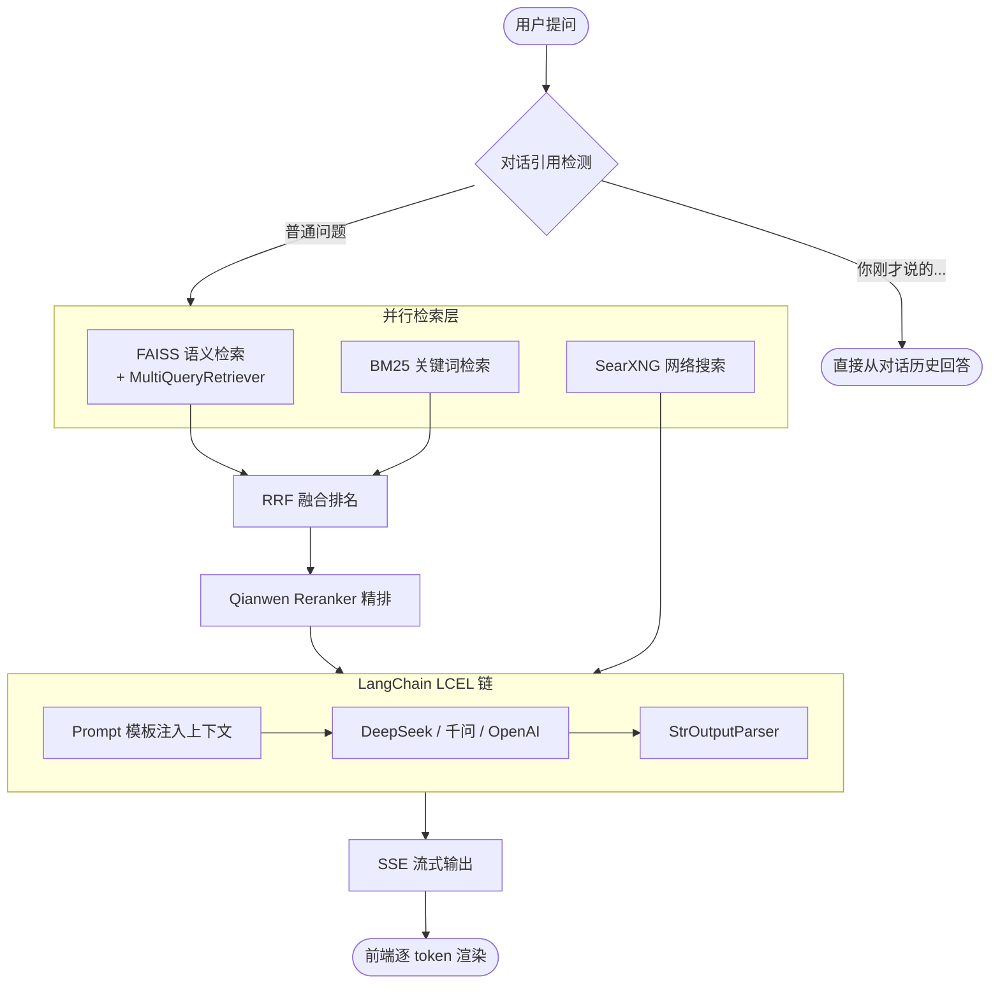

<div align="center">

# 知识库智能问答系统

**一个可以直接跑起来学习的生产级 RAG 项目**

[](https://python.org)
[](https://langchain.com)
[](https://flask.palletsprojects.com)
[](https://github.com/facebookresearch/faiss)
[](LICENSE)
[](https://anthropic.com)
[](README_EN.md)

</div>

---

## 这个项目是什么？

### 从一个真实需求说起

我在做机器视觉领域的知识库问答系统时，发现市面上讲 RAG 的教程虽然很多，但绝大多数停在"调几个 API、拼个最简流程"就结束了——把文档切几刀、存进向量库、检索 top-K、塞进 Prompt——演示一跑，效果看起来不错。

但当真正投入生产、面对真实用户的时候，问题接连出现：

> 📌 文档里明明有 "qwen3-rerank" 这个型号，向量检索就是召回不到——原来 Embedding 模型对专有名词天生不敏感。  
> 📌 检索到了 10 条相关片段，全部塞给 LLM，它反而"迷失"在中间那几条里，忽略了最关键的内容。  
> 📌 用户问"你上面说的那个公式怎么推导"，系统却跑去检索知识库，完全找不到答案。  
> 📌 流式输出开头永远是"根据您提供的知识库内容……"，用户看腻了，但不知道从哪里去掉。  
> 📌 Prompt 改了十几版，没有版本记录，改坏了也不知道怎么回滚。

**每一个问题背后都有一个具体的工程解法，但这些解法散落在论文、源码和零碎的博客里，从未被系统整理过。**

这个项目就是把这些解法完整实现出来，并写成可以对照学习的教学文档。

---

### 项目是什么

**这是一个生产级 RAG 知识库问答系统，同时也是一套完整的 RAG 工程学习资料。**

系统层面，它内置了完整的四层检索管道：

- **FAISS 语义检索**：理解同义词和上下文语义
- **BM25 关键词检索**：精确命中专有名词、型号、参数名
- **RRF 倒数排名融合**：把两路结果取长补短合并
- **Qianwen Reranker 精排**：交叉编码器对候选片段重新评分，只把最相关的送给 LLM

此外还有：SSE 流式输出、对话历史管理、多模型热切换、网络搜索兜底、熔断器保护、提示词版本管理……这些工程能力不是"演示用"，而是真实处理了生产中踩过的坑之后的结果。

教学层面，项目附带 [`lessons/`](lessons/README.md) 目录——**19 篇从零开始的配套教学文档**，覆盖从"LLM 调用基础"到"RAG 五大痛点实战"的完整知识体系。每一篇文档对应主项目中的一个核心模块，讲清楚"为什么这样设计"，而不只是"怎么用"。

---

### 适合谁

| 你的情况 | 能从这个项目得到什么 |
|---------|-------------------|
| 想学习 RAG 工程实现 | 19 篇教学文档 + 可运行代码，从 Embedding 原理到熔断器模式全覆盖 |
| 想做自己领域的知识库 | 直接 clone，替换文档，修改 Prompt，5 分钟启动 |
| 正在用简单 RAG 但效果不好 | 参考四层检索管道和 5 种分块策略，找到召回差的根本原因 |
| 准备面试 LLM 应用岗位 | 每个设计决策都有原理支撑，能说清楚"为什么"而不只是"是什么" |
| 企业内网部署场景 | 纯本地运行，无 SaaS 依赖，数据不出内网 |

---

## 界面预览

**主界面** — 已加载 256 个知识片段，提供推荐问题快速提问


<table>
<tr>
<td width="50%">

**知识库管理** — 拖拽上传文档，一键重建向量索引


</td>
<td width="50%">

**模型配置** — 在线切换服务商、模型、温度，测试连通后保存即生效


</td>
</tr>
</table>

---

## 核心亮点

### 🔍 四层检索管道（召回质量）

普通 RAG 只用向量检索，本项目把检索做成了四层流水线：

```
FAISS 语义检索          → 理解同义词和语义关联
    +
BM25 关键词检索         → 精确命中专有名词、型号、参数名
    ↓
RRF 倒数排名融合        → 两路互补，谁都排前面的一定重要
    ↓
Qianwen Reranker 精排  → 交叉编码器重新评分，送给 LLM 的上下文质量更高
```

仅靠向量检索，搜"qwen3-rerank 参数"可能找不到——Embedding 对专有名词不敏感；  
加上 BM25 之后，精确词汇直接命中，两路结果经 RRF 融合后再精排，召回质量显著提升。

### ⚡ 工程层设计（可用性）

| 特性 | 说明 |
|------|------|
| **SSE 流式输出** | 检索完成立刻推参考资料，LLM 同步逐 token 输出，无白屏等待 |
| **开头套话自动过滤** | "根据知识库内容..." 这类无效开头在缓冲区就被清理掉 |
| **对话引用检测** | 识别"你刚才说的"类问题，跳过检索直接走对话历史 |
| **多模型热切换** | DeepSeek / 千问 / OpenAI / 本地 Ollama，无需重启即时生效 |
| **网络搜索兜底** | 本地知识库无答案时，SearXNG 自动联网补充 |
| **熔断器保护** | 网络搜索连续失败 3 次自动熔断，不拖慢主流程 |
| **提示词版本管理** | system.txt 支持存档/回滚，变量插值，API 热重载 |
| **Token 预算管理** | 对话历史按 Token 数从最新往前截取，永不超出上下文窗口 |
| **Markdown + LaTeX** | 服务端渲染公式和代码块，前端 MathJax 展示 |

### 📄 5 种分块策略（文档质量）

不同结构的文档应该用不同的切分方式，乱切是召回质量差的根源：

| 策略 | 适用场景 | 示例 |
|------|---------|------|
| `markdown` | 有 `##`/`###` 标题的文档 | 技术手册、教程 |
| `regex` | 自定义边界（编号 Q&A） | `1.1 xxx`、`Q1:` |
| `semantic` | 无结构散文 | 报告、论文 |
| `recursive` | 通用保底 | 任意文本 |
| `auto` | **不确定时自动探测** | 默认策略 |

每个知识库子目录可通过 `kb_config.json` 独立配置策略，混合多种文档格式也能精准切分。

### 📚 19 篇配套教学文档（学习价值）

`lessons/` 目录是本项目的学习主线——从"调用一个 LLM"到"真实项目踩坑实录"，共 19 节：

```
概念基础  →  01 LLM调用  02 文本切分  03 Embedding  04 向量数据库  05 文档加载
检索核心  →  06 BM25  07 混合检索RRF  08 Reranker  09 MultiQuery  15 分块策略进阶
系统集成  →  10 RAG完整流程  11 LCEL链  12 Prompt工程  13 SSE流式  14 对话历史
工程实践  →  16 熔断器  17 Flask服务  18 配置管理
实战调优  →  19 RAG五大痛点与解决方案
```

每篇文档包含：原理讲解 → 代码示例 → 与主项目的对应位置 → 动手练习题。  
读完 19 节，主项目每一行代码的设计动机你都能说清楚。

---

## 系统架构



### 技术选型

| 层次 | 技术 | 说明 |
|------|------|------|
| LLM | DeepSeek / OpenAI 兼容接口 | `langchain_openai.ChatOpenAI` |
| Embedding | 千问 `text-embedding-v2` | 中文优化，1536 维 |
| 向量库 | FAISS（本地持久化） | Meta 开源，毫秒级检索 |
| 关键词检索 | BM25 (`rank_bm25`) | 专有名词精确命中 |
| 精排 | 千问 `qwen3-rerank` | 交叉编码器，精度远超向量相似度 |
| 网络搜索 | SearXNG（自托管 Docker） | 隐私保护，无 API 限额 |
| 链式框架 | LangChain LCEL | `Prompt | LLM | Parser` 管道 |
| Web 框架 | Flask + SSE | 轻量，流式推送 |

---

## 快速上手

### 前置条件

- Python 3.10+（推荐 conda 管理环境）
- [DeepSeek API Key](https://platform.deepseek.com/) — LLM 对话
- [阿里云 DashScope API Key](https://dashscope.console.aliyun.com/) — Embedding + Reranker

### 5 步启动

**① 克隆仓库**

```bash
git clone https://github.com/Lanqingsong/rag-from-scratch.git
cd rag-from-scratch
```

**② 创建环境并安装依赖**

```bash
conda create -n rag_env python=3.10 -y
conda activate rag_env
pip install -r requirements.txt
```

**③ 配置 API Key**

```bash
cp .env.example .env
```

编辑 `.env`：

```env
DEEPSEEK_API_KEY=sk-你的DeepSeek密钥
QIANWEN_API_KEY=sk-你的阿里云密钥
```

**④ 放入你的文档**

将 `.txt` / `.md` / `.pdf` 文件放入 `knowledge_base/` 目录。

**⑤ 启动**

```bash
python app.py
```

浏览器访问 `http://localhost:5000`，首次启动自动构建向量库。

---

## 使用说明

### Web 模式（推荐）

- 输入框输入问题，`Ctrl+Enter` 发送
- 回答流式逐字显示，右侧同步展示参考资料来源
- 点击 **⊙ 模型配置** 切换 LLM，填写后点"测试连接"验证，保存后即时生效

**支持的模型服务商：**

| 服务商 | base_url | 推荐模型 |
|--------|----------|---------|
| DeepSeek | `https://api.deepseek.com` | `deepseek-chat` |
| 千问（阿里） | `https://dashscope.aliyuncs.com/compatible-mode/v1` | `qwen-max-latest` |
| OpenAI | `https://api.openai.com/v1` | `gpt-4o` |
| 本地 Ollama | `http://localhost:11434/v1` | `qwen2.5:14b` |

### CLI 模式

```bash
python main.py
```

```
请输入您的问题：镜头焦距如何计算？

找到 3 条相关知识：
【参考资料 1】来源: 机器视觉第一部分.md  内容: f = WD × sensor_size / FOV ...

【AI回答】
焦距计算需要三个参数：工作距离（WD）、传感器尺寸和视野范围（FOV）...

输入 rebuild 重建向量库，quit 退出
```

### 启用网络搜索（可选）

```bash
# 启动 SearXNG（首次）
docker run -d --name searxng -p 8080:8080 searxng/searxng

# 开启 JSON API 支持
docker exec searxng sed -i 's/- html/- html\n  - json/' /etc/searxng/settings.yml
docker restart searxng
```

不配置 Docker 时系统正常运行，仅禁用网络搜索功能。

---

## 知识库管理

点击界面顶部 **■ 知识库** 按钮，或直接操作文件系统：

```
knowledge_base/
├── 技术手册.md          # 推荐格式，自动按 ### 标题切割
├── 产品文档.pdf         # 自动提取文本
├── FAQ.txt             # 自动探测编号结构
└── kb_config.json      # 可选：为该目录指定分块策略
```

**分块策略示例（`kb_config.json`）：**

```json
{ "strategy": "markdown", "heading_level": 3, "chunk_size": 1000 }
```

修改文档后，点击"重建向量索引"或调用接口触发重建：

```bash
curl -X POST http://localhost:5000/api/kb/rebuild
curl http://localhost:5000/api/kb/rebuild/status   # 查看进度
```

---

## 配置参考

| 参数 | 默认值 | 说明 |
|------|--------|------|
| `TOP_K_RESULTS` | `5` | 检索候选文档数 |
| `RERANK_TOP_K` | `3` | Reranker 保留数（送入 LLM） |
| `KB_RELEVANCE_SCORE` | `0.62` | FAISS 相似度阈值 |
| `MULTI_QUERY_RETRIEVAL` | `True` | 启用多角度查询改写 |
| `MAX_HISTORY_TOKENS` | `3000` | 对话历史 Token 预算 |
| `WEB_SEARCH_ENABLED` | `True` | 启用网络搜索 |
| `TEMPERATURE` | `0.7` | LLM 温度 |
| `MAX_TOKENS` | `2048` | 单次最大输出 Token 数 |

提示词文件：`prompt_templates/system.txt`，修改后调用 `POST /api/prompts/reload` 热重载。

---

## 学习路径（`lessons/` 目录）

> 如果你的目标是**搞懂这套系统是怎么做的**，从这里开始。

`lessons/` 目录包含 18 篇系统教学文档，每篇对应主项目中的一个核心模块，  
概念讲解 + 代码示例 + 动手练习，全程对照主项目源码。

| 阶段 | 内容 |
|------|------|
| 概念基础 | [01 LLM调用](lessons/01_LLM调用基础.md) · [02 文本切分](lessons/02_文本切分策略.md) · [03 Embedding](lessons/03_Embedding向量化.md) · [04 向量数据库](lessons/04_向量数据库.md) · [05 文档加载](lessons/05_文档加载与解析.md) |
| 检索核心 | [06 BM25](lessons/06_BM25关键词检索.md) · [07 混合检索RRF](lessons/07_混合检索与RRF融合.md) · [08 Reranker](lessons/08_Reranker精排.md) · [09 MultiQuery](lessons/09_MultiQuery检索扩写.md) · [15 分块策略进阶](lessons/15_5种分块策略进阶.md) |
| 系统集成 | [10 RAG完整流程](lessons/10_RAG完整流程.md) · [11 LCEL链](lessons/11_LCEL链式编程.md) · [12 Prompt工程](lessons/12_Prompt模板与提示词工程.md) · [13 SSE流式输出](lessons/13_SSE流式输出.md) · [14 对话历史](lessons/14_对话历史管理.md) |
| 工程实践 | [16 熔断器](lessons/16_网络搜索与熔断器.md) · [17 Flask服务](lessons/17_Flask_Web服务设计.md) · [18 配置管理](lessons/18_配置管理与工程实践.md) |
| 实战调优 | [19 RAG五大痛点与解决方案](lessons/19_RAG五大痛点与解决方案.md) |

详见 [lessons/README.md](lessons/README.md)

---

## 项目结构

```
zhishiku/
├── app.py                # Flask 主服务：路由、SSE 流、知识库管理 API
├── config.py             # 配置中枢（.env → model_config.json 三层覆盖）
├── knowledge_base.py     # 核心：FAISS + BM25 + RRF + Reranker + MultiQuery
├── splitters.py          # 5 种分块策略 + Auto 自动探测
├── llm_client.py         # LCEL 链组装，4 种 Prompt 模式自动选择
├── prompts.py            # Prompt 模板 + 热重载 + 变量插值
├── web_search.py         # SearXNG 网络搜索 + 熔断器
├── main.py               # CLI 入口
│
├── knowledge_base/       # 放置知识文档（.md / .txt / .pdf）
├── vector_store/         # FAISS 向量库（自动生成）
├── prompt_templates/     # system.txt + variables.json + 版本存档
├── templates/            # 前端页面（Markdown + MathJax + SSE）
│
├── lessons/              # 📖 19 篇配套教学文档 + 可运行实验代码
│   ├── README.md
│   ├── 01_LLM调用基础.md ~ 19_RAG五大痛点与解决方案.md
│   └── *.py              # 配套实验代码
│
├── docs/screenshots/     # 界面截图
├── .env.example          # 环境变量模板
├── requirements.txt      # Python 依赖
└── LICENSE               # MIT
```

---

## 为什么不用 Coze / Dify / FastGPT？

这是个好问题。Coze、Dify、FastGPT 都是优秀的产品，但我选择从零用 LangChain 实现，原因有以下几点：

### 1. 企业场景的现实约束

许多企业的内网环境**不允许安装第三方平台**，或者安全审计要求不得使用 SaaS 工具处理内部文档。  
本项目是纯 Python + 几个标准库，依赖关系完全透明，能部署在任何能跑 Python 的环境里——包括没有 Docker、没有公网的服务器。

### 2. 灵活性：改一行代码能影响整个管道

平台工具是**黑盒**，你看不到也改不了检索内部的逻辑。  
本项目每个节点都在代码里暴露出来：

- 想把 BM25 权重从 0.5 调成 0.3？改 `knowledge_base.py` 一行
- 想在 Reranker 之前加一步关键词过滤？直接插函数
- 想把网络搜索结果和知识库结果用不同的 Prompt 模板分别处理？完全支持

这种**可编程性**在企业定制场景里至关重要，用平台工具根本做不到。

### 3. 同时融合本地知识库 + 实时互联网

本项目天然支持在同一次回答里混用两种来源：

```
用户提问
    ↓
本地 RAG 检索（私有文档）
    +
SearXNG 网络搜索（实时公开信息）
    ↓
统一注入 Prompt，LLM 综合回答
```

平台工具通常只支持其中一种，或者两种来源之间的融合逻辑是固定的、不可配置的。

### 4. 根据文档特征自定义分块

不同类型的文档有完全不同的最优分块策略：

| 文档类型 | 平台工具 | 本项目 |
|---------|---------|--------|
| 有 `##` 标题的技术手册 | 固定大小切分，标题被截断 | `MarkdownHeadingSplitter`，按标题完整保留 |
| `1.1 xxx` 编号的 Q&A 文档 | 不识别编号结构 | `RegexBoundarySplitter`，按编号边界切分 |
| 无结构散文 | 固定大小切分 | `SemanticSplitter`，按语义断点切分 |
| 格式不确定的新目录 | 只能手动选 | `AutoSplitter`，自动探测格式 |

切分质量直接决定召回质量，这一步做差了，后面再怎么优化都是在弥补先天不足。

### 5. 部署极简，没有平台依赖

```bash
git clone ...
pip install -r requirements.txt
python app.py        # 就这三步
```

不需要注册账号，不需要持续缴费，不依赖第三方平台存活。  
你的数据完全在自己服务器上，向量库是本地 FAISS 文件，文档也在本地目录里。

### 6. 对学习者的价值

如果你用 Dify 点点按钮搭出一个 RAG，你只知道"RAG 是这么用的"。  
如果你从本项目读完 19 节教学文档，你会明白：

- 为什么要用 `score = 1/(k + rank)` 这个公式而不是直接取 top-K
- 为什么流式输出要在缓冲区先攒 40 个字符才往外推
- 为什么 `token budget` 要从**最新**对话往前截而不是从最早的往后截
- 为什么对话引用检测要在检索之前而不是之后做

这些"为什么"是真正理解大模型应用开发的关键，也是求职面试时能说出来的东西。

---

**Q: 启动报 `DEEPSEEK_API_KEY 未设置`**  
确认项目根目录有 `.env` 文件，内容为 `DEEPSEEK_API_KEY=sk-xxx`。

**Q: 检索命中 0 条**  
日志出现 `KB 命中：FAISS=0 BM25=0` 时，先确认 `vector_store/` 已构建。  
仍为 0 则将 `KB_RELEVANCE_SCORE` 调低到 `0.5` 试试。

**Q: BM25 不可用**  
```bash
pip install rank_bm25
```

**Q: 换模型后回答质量下降**  
编辑 `prompt_templates/system.txt` 调整指令风格，调用 `POST /api/prompts/reload` 热重载。

**Q: 如何换成自己领域的知识库**  
替换 `knowledge_base/` 中的文档 → 修改 `system.txt` 的角色设定 → 删除 `vector_store/` → 重启自动重建。

---

## AI 协作声明

本项目由人类开发者与 **Claude AI**（Anthropic）协作完成，包括：

- **系统架构与核心代码**：开发者主导设计，Claude AI 参与代码实现与调试
- **19 篇教学文档**：基于开发者的实战经验与知识点梳理，由 Claude AI 辅助撰写与结构化
- **README 与项目文档**：开发者提供内容框架与素材，Claude AI 参与文字组织与排版

这是一次真实的人机协作实践——所有技术决策、踩坑经历和领域知识来自开发者，  
AI 负责把这些经验转化为结构清晰、便于学习的文档与代码。

---

## 开源协议

本项目基于 [MIT License](LICENSE) 开源，可自由用于学习、二次开发和商业部署。

---

<div align="center">

如果本项目对你有帮助，欢迎点个 ⭐ Star

[English README](README_EN.md) · [教学文档](lessons/README.md) · [提交 Issue](../../issues)

</div>
