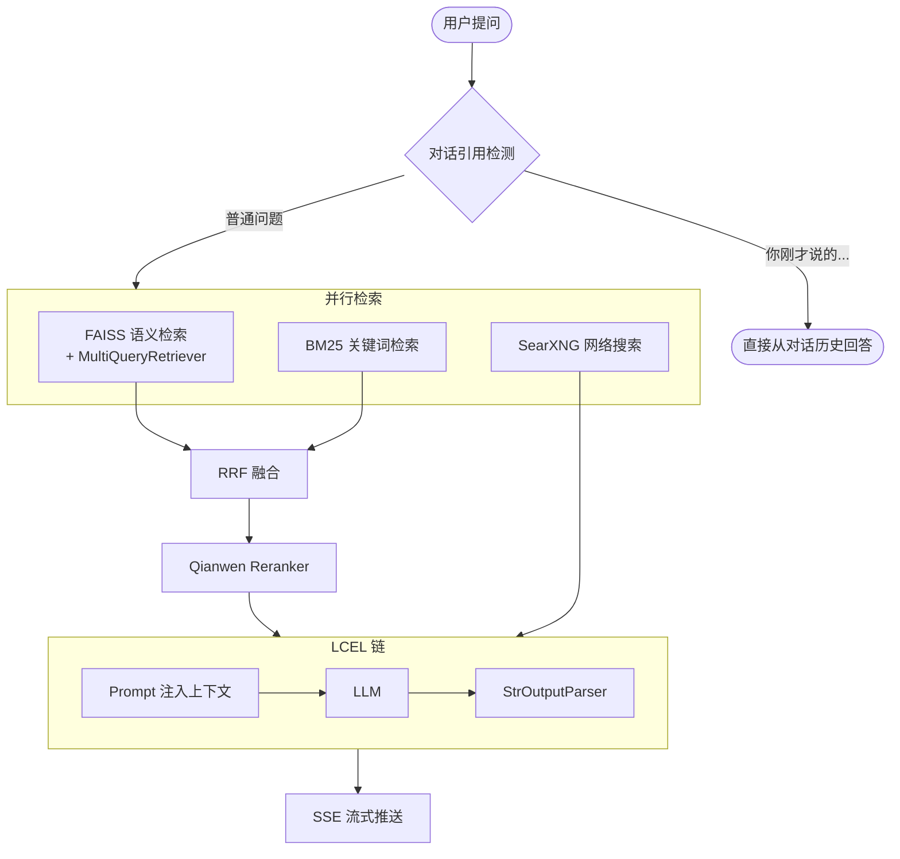

<div align="right">
  <strong>中文</strong> | <a href="README_EN.md">English</a>
</div>

<div align="center">

# RAG 知识库问答系统

[](https://python.org)
[](https://langchain.com)
[](https://flask.palletsprojects.com)
[](LICENSE)
[](https://anthropic.com)

</div>

用 LangChain + DeepSeek + FAISS 从头搭的知识库问答系统，附带 **19 篇教学文档**。

Demo 级 RAG 两小时能做出来，但真给人用之后会碰到这些问题：搜型号编码一条找不到、LLM 忽略了中间那几条上下文、多轮对话里"你刚才说的"被当成新问题去检索、流式输出开头全是废话。这个项目是把这些问题逐个处理完之后的结果，每个工程决策在 `lessons/` 里都有对应的原理解释。

---

## 界面


<table>
<tr>
<td width="50%">

**知识库管理** — 拖拽上传，一键重建索引


</td>
<td width="50%">

**模型配置** — 在线切换服务商，测试后即时生效


</td>
</tr>
</table>

---

## 快速上手

**前置条件：** Python 3.10+、[DeepSeek API Key](https://platform.deepseek.com/)、[阿里云 DashScope API Key](https://dashscope.console.aliyun.com/)

```bash
git clone https://github.com/Lanqingsong/rag-from-scratch.git
cd rag-from-scratch

conda create -n rag_env python=3.10 -y && conda activate rag_env
pip install -r requirements.txt

cp .env.example .env
# 编辑 .env，填写 DEEPSEEK_API_KEY 和 QIANWEN_API_KEY

# 把文档放进 knowledge_base/（.md / .txt / .pdf 均可）
python app.py
```

浏览器访问 `http://localhost:5000`，首次启动自动构建向量库。

> 不想配 SearXNG 的话，在 `.env` 里设 `WEB_SEARCH_ENABLED=False`，其余功能不受影响。

---

## 检索管道

普通 RAG 只有向量检索一层，这个项目是四层：

```
用户提问
  ↓
[对话引用检测] ── "你刚才说的" → 跳过检索，直接走对话历史
  ↓
FAISS 语义检索        理解同义词、上下文关联
  +
BM25 关键词检索       精确命中型号编码、参数名、专有名词
  ↓
RRF 倒数排名融合      两路结果合并，公式：score = 1/(60 + rank)
  ↓
Qianwen Reranker     交叉编码器精排，只把最相关的 3 条送给 LLM
  ↓
DeepSeek / 千问 / 任意 OpenAI 兼容接口
  ↓
SSE 流式输出
```

每层存在的具体原因：

- **BM25**：Embedding 对训练语料里低频词不敏感，搜"CS-040GX"这类型号编码向量相似度几乎为零，BM25 直接字符匹配填补这个盲区。
- **RRF**：两路检索的打分量纲不同，不能直接合并，RRF 只用排名不用分数，避免量纲问题。
- **Reranker**：Embedding 检索是双编码器，查询和文档分开编码，精度有上限；Reranker 是交叉编码器，两者拼在一起过模型，精度更高，代价是慢，所以只在最后精排阶段用。

---

## 文档切分

切分方式比 chunk_size 更重要。同一份技术手册，按标题切和按固定字符切，召回质量差距悬殊。项目支持 5 种策略，通过每个子目录的 `kb_config.json` 单独配置：

| 策略 | 适用文档 | 配置示例 |
|------|---------|---------|
| `markdown` | 有 `##`/`###` 标题的手册、教程 | `{"strategy":"markdown","heading_level":3}` |
| `regex` | 编号格式文档（`1.1 xxx`、`Q1:`） | `{"strategy":"regex","pattern":"\\d+\\.\\d+\\s+[^\\n]+"}` |
| `semantic` | 无结构散文、报告 | `{"strategy":"semantic","threshold_value":95}` |
| `recursive` | 通用保底 | `{"strategy":"recursive"}` |
| `auto` | 不确定时，自动探测文档结构 | `{"strategy":"auto"}` ← 默认 |

---

## 其他功能

| 功能 | 说明 |
|------|------|
| SSE 流式输出 | 检索完先推参考资料，LLM 同步逐 token 输出 |
| 套话过滤 | "根据知识库内容…" 这类开头在缓冲区被拦截 |
| 多模型热切换 | DeepSeek / 千问 / OpenAI / Ollama，无需重启 |
| 网络搜索兜底 | SearXNG 自托管，本地知识库无答案时自动联网 |
| 熔断器 | 搜索服务连续失败 3 次自动断路，60s 后尝试恢复 |
| Prompt 版本管理 | system.txt 存档/回滚，变量插值，API 热重载 |
| Token 预算管理 | 对话历史从最新往前按 Token 数截取 |
| Markdown + LaTeX | 服务端渲染，MathJax 展示公式 |

---

## 系统架构



---

## 学习路径

`lessons/` 目录包含 19 篇配套教学文档，每篇对应主项目一个核心模块，讲原理 + 代码 + 设计动机：

| 阶段 | 文档 |
|------|------|
| 概念基础 | [01 LLM调用](lessons/01_LLM调用基础.md) · [02 文本切分](lessons/02_文本切分策略.md) · [03 Embedding](lessons/03_Embedding向量化.md) · [04 向量数据库](lessons/04_向量数据库.md) · [05 文档加载](lessons/05_文档加载与解析.md) |
| 检索核心 | [06 BM25](lessons/06_BM25关键词检索.md) · [07 混合检索RRF](lessons/07_混合检索与RRF融合.md) · [08 Reranker](lessons/08_Reranker精排.md) · [09 MultiQuery](lessons/09_MultiQuery检索扩写.md) · [15 分块策略进阶](lessons/15_5种分块策略进阶.md) |
| 系统集成 | [10 RAG完整流程](lessons/10_RAG完整流程.md) · [11 LCEL链](lessons/11_LCEL链式编程.md) · [12 Prompt工程](lessons/12_Prompt模板与提示词工程.md) · [13 SSE流式](lessons/13_SSE流式输出.md) · [14 对话历史](lessons/14_对话历史管理.md) |
| 工程实践 | [16 熔断器](lessons/16_网络搜索与熔断器.md) · [17 Flask服务](lessons/17_Flask_Web服务设计.md) · [18 配置管理](lessons/18_配置管理与工程实践.md) |
| 实战调优 | [19 RAG五大痛点与解决方案](lessons/19_RAG五大痛点与解决方案.md) |

详见 [lessons/README.md](lessons/README.md)

---

## 项目结构

```
rag-from-scratch/
├── app.py               # Flask 服务：路由、SSE、知识库管理 API
├── knowledge_base.py    # FAISS + BM25 + RRF + Reranker + MultiQueryRetriever
├── splitters.py         # 5 种分块策略 + Auto 探测
├── llm_client.py        # LCEL 链，4 种 Prompt 模式自动选择
├── prompts.py           # Prompt 热重载 + 变量插值
├── web_search.py        # SearXNG + 熔断器
├── config.py            # 三层配置（.env → model_config.json → 默认值）
│
├── knowledge_base/      # 放知识文档（.md / .txt / .pdf）
├── vector_store/        # FAISS 向量库（自动生成）
├── prompt_templates/    # system.txt + variables.json + 版本存档
│
└── lessons/             # 19 篇教学文档 + 配套实验代码
```

---

## 配置参考

主要参数在 `config.py`，可通过 `.env` 或界面覆盖：

| 参数 | 默认值 | 说明 |
|------|--------|------|
| `TOP_K_RESULTS` | `5` | 检索候选文档数 |
| `RERANK_TOP_K` | `3` | Reranker 后保留数（送入 LLM） |
| `KB_RELEVANCE_SCORE` | `0.62` | FAISS 相似度阈值，召回 0 条时可调低 |
| `MULTI_QUERY_RETRIEVAL` | `True` | 启用多角度查询改写 |
| `MAX_HISTORY_TOKENS` | `3000` | 对话历史 Token 预算 |
| `WEB_SEARCH_ENABLED` | `True` | 启用网络搜索（需 SearXNG） |

**切换模型：** 界面点击"模型配置"，填写 API Key 和 base_url，保存即时生效。常用服务商：

| 服务商 | base_url | 示例模型 |
|--------|----------|---------|
| DeepSeek | `https://api.deepseek.com` | `deepseek-chat` |
| 阿里云 | `https://dashscope.aliyuncs.com/compatible-mode/v1` | `qwen-max-latest` |
| OpenAI | `https://api.openai.com/v1` | `gpt-4o` |
| 本地 Ollama | `http://localhost:11434/v1` | `qwen2.5:14b` |

---

## 常见问题

**Q: 启动报 `DEEPSEEK_API_KEY 未设置`**  
项目根目录需要有 `.env` 文件，内容 `DEEPSEEK_API_KEY=sk-xxx`。

**Q: 检索命中 0 条（日志显示 `FAISS=0 BM25=0`）**  
先确认 `vector_store/` 已生成。若已生成仍为 0，把 `KB_RELEVANCE_SCORE` 调低到 `0.5`。

**Q: `rank_bm25` 不可用**  
```bash
pip install rank_bm25
```

**Q: 换成自己的知识库**  
替换 `knowledge_base/` 里的文档 → 修改 `prompt_templates/system.txt` 里的角色设定 → 删除 `vector_store/` → 重启自动重建。

**Q: 启用网络搜索**  
```bash
docker run -d --name searxng -p 8080:8080 searxng/searxng
docker exec searxng sed -i 's/- html/- html\n  - json/' /etc/searxng/settings.yml
docker restart searxng
```

---

## AI 协作声明

本项目由 [lanqingsong874953727@outlook.com](mailto:lanqingsong874953727@outlook.com) 与 AI 助手协作开发。

## 开源协议

[MIT License](LICENSE)

---

<div align="center">

如果本项目对你有帮助，欢迎点个 ⭐

[教学文档](lessons/README.md) · [提交 Issue](../../issues)

</div>
