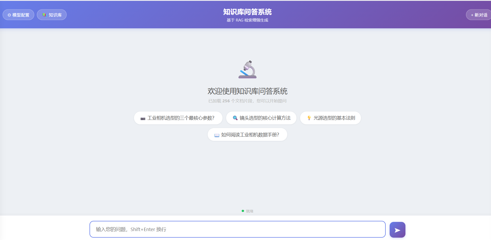
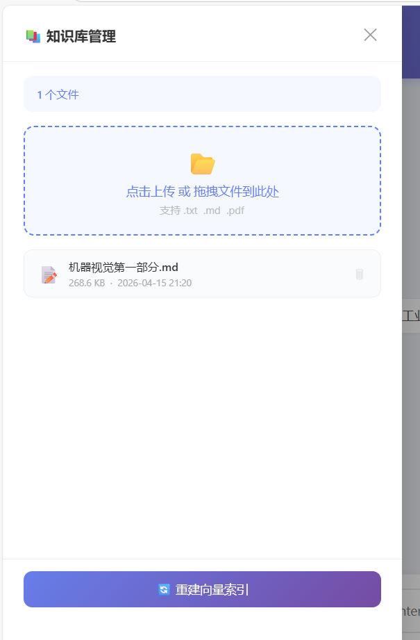
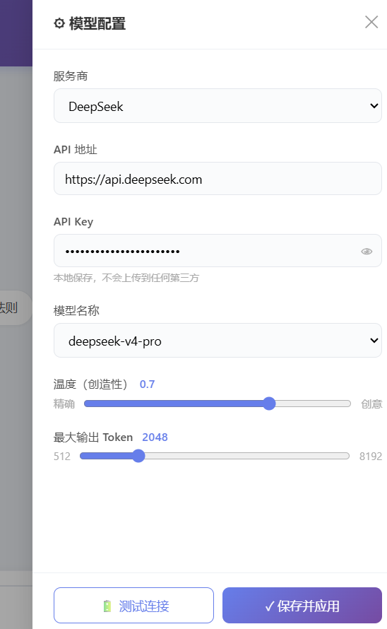
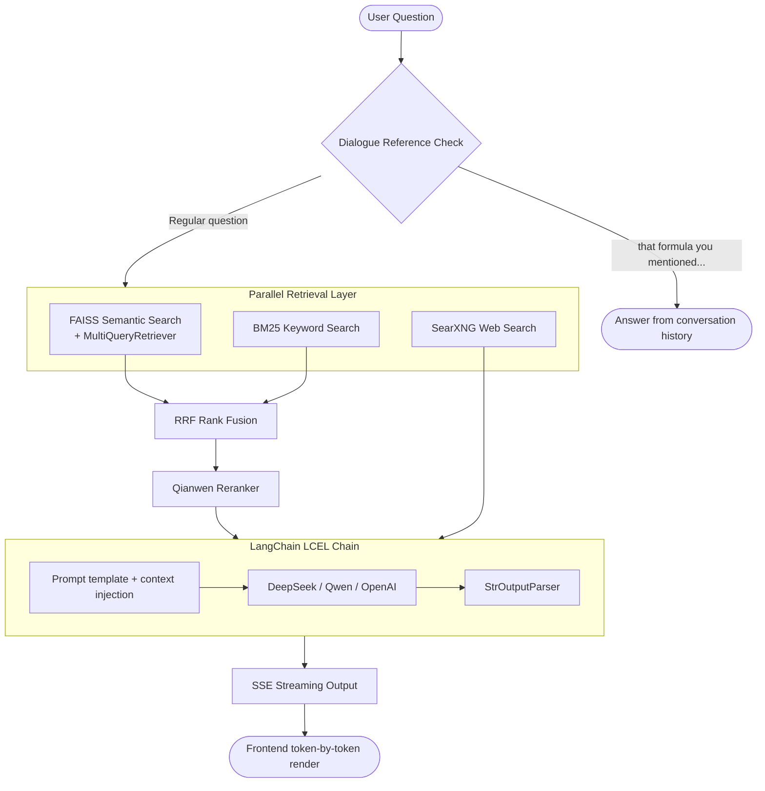

<div align="center">

# Knowledge Base Q&A System

**A production-grade RAG project you can run, study, and build upon**

[](https://python.org)
[](https://langchain.com)
[](https://flask.palletsprojects.com)
[](https://github.com/facebookresearch/faiss)
[](LICENSE)
[](https://anthropic.com)
[](README.md)

</div>

---

## What is this project?

### The real problem with RAG tutorials

Most RAG tutorials end at: chunk your docs → store in a vector DB → retrieve top-K → shove into a prompt → done.
That works fine for a demo. But when you ship it to real users, things fall apart fast:

> 📌 Your docs mention "qwen3-rerank" by name, but semantic search never retrieves it — embeddings are notoriously blind to exact proper nouns and model names.  
> 📌 You retrieve 10 relevant chunks and pass them all to the LLM. It ignores the most important one buried in the middle — a real phenomenon called **"Lost in the Middle."**  
> 📌 User asks *"can you explain that formula you mentioned earlier?"* — your system fires a knowledge-base search and comes back empty.  
> 📌 Every streaming response starts with *"Based on the knowledge base content provided…"* — users hate it, but you can't figure out where to cut it.  
> 📌 You've iterated your system prompt fifteen times with no version history. You broke something and can't roll back.

**Every one of these problems has a concrete engineering solution. But those solutions are scattered across papers, source code, and obscure blog posts — never assembled in one place.**

This project assembles them. And documents every decision so you can understand *why*, not just *how*.

---

### What it is

**A production-ready RAG Q&A system and a complete RAG engineering learning resource — in the same codebase.**

On the **system side**, it ships a four-layer retrieval pipeline:

- **FAISS semantic search** — understands synonyms and contextual meaning
- **BM25 keyword search** — exact hits on proper nouns, model names, parameter names
- **RRF (Reciprocal Rank Fusion)** — merges both result sets so neither source dominates unfairly
- **Qianwen Reranker** — cross-encoder rescoring; only the truly relevant chunks reach the LLM

Plus: SSE streaming output, conversation history management, live model switching, web search fallback, circuit breaker protection, prompt version management — all production-hardened.

On the **learning side**, the [`lessons/`](lessons/README.md) directory contains **19 structured teaching documents** covering everything from "what is an embedding" to "five real RAG failure modes and how to fix them." Each lesson explains the *why* behind each design decision, not just the *what*.

---

### Who is this for?

| Your situation | What you'll get |
|----------------|-----------------|
| Learning RAG engineering | 19 lessons + runnable code, from embedding fundamentals to circuit breaker patterns |
| Building your own domain knowledge base | Clone, drop in your docs, edit the prompt, up in 5 minutes |
| Using basic RAG but getting poor results | The 4-layer pipeline and 5 chunking strategies will show you exactly where recall breaks down |
| Preparing for LLM engineering interviews | Every design decision has a principled reason you can articulate |
| Enterprise on-premise deployment | Fully local, no SaaS dependencies, data never leaves your server |

---

## Screenshots

**Main interface** — 256 knowledge chunks loaded, suggested questions for quick access



<table>
<tr>
<td width="50%">

**Knowledge base management** — drag-and-drop upload, one-click index rebuild



</td>
<td width="50%">

**Model configuration** — switch providers, models, and temperature live; test before saving



</td>
</tr>
</table>

---

## Key Features

### 🔍 Four-Layer Retrieval Pipeline (recall quality)

Standard RAG uses vector search alone. This project builds a full pipeline:

```
FAISS semantic search        → understands synonyms and semantic relationships
    +
BM25 keyword search          → exact match on proper nouns, part numbers, param names
    ↓
RRF rank fusion              → combines both; anything ranked high in either list wins
    ↓
Qianwen Reranker             → cross-encoder rescoring; only the best reach the LLM
```

Searching "qwen3-rerank parameters" with embeddings alone often misses — embeddings are weak on exact terms. BM25 catches it. The two results are fused via RRF, then the reranker picks the winners. Recall improves significantly.

### ⚡ Engineering Features (reliability)

| Feature | Description |
|---------|-------------|
| **SSE streaming** | References pushed immediately after retrieval; tokens stream as LLM generates — no blank-screen waiting |
| **Filler opener filter** | "Based on the knowledge base…" type openers are stripped in the output buffer before they reach the user |
| **Dialogue reference detection** | Recognizes "what you just said" / "that formula earlier" — skips KB search, answers from conversation history |
| **Live model switching** | DeepSeek / Qwen / OpenAI / local Ollama — switch without restarting the server |
| **Web search fallback** | When the local KB has no answer, SearXNG retrieves live web results automatically |
| **Circuit breaker** | Web search auto-trips after 3 consecutive failures; main flow is never blocked |
| **Prompt version management** | `system.txt` supports archive / rollback, variable interpolation, hot reload via API |
| **Token budget management** | Conversation history truncated newest-first to stay within the context window |
| **Markdown + LaTeX** | Server-side rendering of formulas and code blocks; MathJax on the frontend |

### 📄 5 Chunking Strategies (document quality)

Wrong chunking is the root cause of poor recall. Different document structures need different strategies:

| Strategy | Best for | Example |
|----------|----------|---------|
| `markdown` | Docs with `##`/`###` headings | Technical manuals, tutorials |
| `regex` | Custom boundaries (numbered Q&A) | `1.1 xxx`, `Q1:` patterns |
| `semantic` | Unstructured prose | Reports, papers |
| `recursive` | General-purpose fallback | Any text |
| `auto` | **When you're not sure** | Default strategy |

Each subdirectory in the knowledge base can have its own `kb_config.json` to specify a strategy independently — mixed document formats handled cleanly.

### 📚 19 Teaching Documents (learning value)

`lessons/` is the learning backbone — from "call your first LLM" to "debug real production failures," 19 lessons:

```
Foundations  →  01 LLM basics  02 text splitting  03 embeddings  04 vector DB  05 doc loading
Retrieval    →  06 BM25  07 hybrid search + RRF  08 Reranker  09 MultiQuery  15 advanced chunking
Integration  →  10 full RAG flow  11 LCEL chains  12 prompt engineering  13 SSE streaming  14 history mgmt
Production   →  16 circuit breaker  17 Flask API design  18 config management
Tuning       →  19 five RAG pain points & solutions
```

Each lesson: concept explanation → code example → where it appears in the main project → hands-on exercises.
After lesson 19, you can explain the reason behind every line of code in this project.

> **Note:** Teaching documents are currently written in Chinese. English translations are planned.

---

## Architecture



### Tech Stack

| Layer | Technology | Notes |
|-------|-----------|-------|
| LLM | DeepSeek / OpenAI-compatible | `langchain_openai.ChatOpenAI` |
| Embedding | Qwen `text-embedding-v2` | Chinese-optimized, 1536-dim |
| Vector store | FAISS (local persistence) | Meta open-source, millisecond retrieval |
| Keyword search | BM25 (`rank_bm25`) | Exact proper noun matching |
| Reranker | Qwen `qwen3-rerank` | Cross-encoder; far more accurate than cosine similarity |
| Web search | SearXNG (self-hosted Docker) | Privacy-preserving, no API quota |
| Chain framework | LangChain LCEL | `Prompt \| LLM \| Parser` pipeline |
| Web framework | Flask + SSE | Lightweight, streaming-ready |

---

## Quick Start

### Prerequisites

- Python 3.10+ (conda recommended)
- [DeepSeek API Key](https://platform.deepseek.com/) — for LLM conversation
- [Alibaba Cloud DashScope API Key](https://dashscope.console.aliyun.com/) — for Embedding + Reranker

### 5-Step Setup

**① Clone the repo**

```bash
git clone https://github.com/Lanqingsong/rag-from-scratch.git
cd rag-from-scratch
```

**② Create environment and install dependencies**

```bash
conda create -n rag_env python=3.10 -y
conda activate rag_env
pip install -r requirements.txt
```

**③ Configure API keys**

```bash
cp .env.example .env
```

Edit `.env`:

```env
DEEPSEEK_API_KEY=sk-your-deepseek-key
QIANWEN_API_KEY=sk-your-alibaba-dashscope-key
```

**④ Add your documents**

Drop `.txt` / `.md` / `.pdf` files into the `knowledge_base/` directory.

**⑤ Launch**

```bash
python app.py
```

Open `http://localhost:5000` in your browser. The vector index builds automatically on first start.

---

## Usage

### Web mode (recommended)

- Type your question and press `Ctrl+Enter` to send
- Answer streams token by token; source references appear on the right in real time
- Click **⊙ Model Config** to switch LLM provider — test the connection, then save to apply instantly

**Supported providers:**

| Provider | base_url | Recommended model |
|----------|----------|-------------------|
| DeepSeek | `https://api.deepseek.com` | `deepseek-chat` |
| Qwen (Alibaba) | `https://dashscope.aliyuncs.com/compatible-mode/v1` | `qwen-max-latest` |
| OpenAI | `https://api.openai.com/v1` | `gpt-4o` |
| Local Ollama | `http://localhost:11434/v1` | `qwen2.5:14b` |

### CLI mode

```bash
python main.py
```

```
Enter your question: How is lens focal length calculated?

Found 3 relevant knowledge chunks:
[Reference 1] Source: machine_vision_part1.md  Content: f = WD × sensor_size / FOV ...

[AI Answer]
Focal length calculation requires three parameters: working distance (WD),
sensor size, and field of view (FOV)...

Type 'rebuild' to rebuild the vector index, 'quit' to exit
```

### Enable web search (optional)

```bash
# Start SearXNG (first time)
docker run -d --name searxng -p 8080:8080 searxng/searxng

# Enable JSON API output
docker exec searxng sed -i 's/- html/- html\n  - json/' /etc/searxng/settings.yml
docker restart searxng
```

Without Docker, the system runs normally — web search is simply disabled.

---

## Knowledge Base Management

Click **■ Knowledge Base** in the top bar, or manage files directly:

```
knowledge_base/
├── technical_manual.md    # Recommended: auto-split by ### headings
├── product_docs.pdf       # Auto text extraction
├── faq.txt                # Auto-detects numbered structure
└── kb_config.json         # Optional: per-directory chunking strategy
```

**Chunking strategy config (`kb_config.json`):**

```json
{ "strategy": "markdown", "heading_level": 3, "chunk_size": 1000 }
```

After modifying documents, click "Rebuild Vector Index" or call the API:

```bash
curl -X POST http://localhost:5000/api/kb/rebuild
curl http://localhost:5000/api/kb/rebuild/status   # poll for progress
```

---

## Configuration Reference

| Parameter | Default | Description |
|-----------|---------|-------------|
| `TOP_K_RESULTS` | `5` | Number of candidate chunks to retrieve |
| `RERANK_TOP_K` | `3` | Chunks kept after reranking (sent to LLM) |
| `KB_RELEVANCE_SCORE` | `0.62` | FAISS similarity threshold |
| `MULTI_QUERY_RETRIEVAL` | `True` | Enable multi-angle query rewriting |
| `MAX_HISTORY_TOKENS` | `3000` | Conversation history token budget |
| `WEB_SEARCH_ENABLED` | `True` | Enable web search fallback |
| `TEMPERATURE` | `0.7` | LLM temperature |
| `MAX_TOKENS` | `2048` | Max output tokens per response |

Prompt file: `prompt_templates/system.txt` — hot-reload after editing via `POST /api/prompts/reload`.

---

## Learning Path (`lessons/` directory)

> If your goal is to **understand how this system works**, start here.

`lessons/` contains 19 structured teaching documents, each covering one core module of the main project.
Concept explanation + code example + hands-on exercises, all cross-referenced to the source code.

| Stage | Content |
|-------|---------|
| Foundations | [01 LLM Basics](lessons/01_LLM调用基础.md) · [02 Text Splitting](lessons/02_文本切分策略.md) · [03 Embeddings](lessons/03_Embedding向量化.md) · [04 Vector DB](lessons/04_向量数据库.md) · [05 Doc Loading](lessons/05_文档加载与解析.md) |
| Retrieval Core | [06 BM25](lessons/06_BM25关键词检索.md) · [07 Hybrid Search + RRF](lessons/07_混合检索与RRF融合.md) · [08 Reranker](lessons/08_Reranker精排.md) · [09 MultiQuery](lessons/09_MultiQuery检索扩写.md) · [15 Advanced Chunking](lessons/15_5种分块策略进阶.md) |
| System Integration | [10 Full RAG Flow](lessons/10_RAG完整流程.md) · [11 LCEL Chains](lessons/11_LCEL链式编程.md) · [12 Prompt Engineering](lessons/12_Prompt模板与提示词工程.md) · [13 SSE Streaming](lessons/13_SSE流式输出.md) · [14 History Management](lessons/14_对话历史管理.md) |
| Production | [16 Circuit Breaker](lessons/16_网络搜索与熔断器.md) · [17 Flask API Design](lessons/17_Flask_Web服务设计.md) · [18 Config Management](lessons/18_配置管理与工程实践.md) |
| Tuning | [19 Five RAG Pain Points & Solutions](lessons/19_RAG五大痛点与解决方案.md) |

> Lesson documents are currently written in Chinese.

See [lessons/README.md](lessons/README.md) for the full guide.

---

## Project Structure

```
zhishiku/
├── app.py                # Flask server: routes, SSE streaming, KB management API
├── config.py             # Config hub (.env → model_config.json three-tier override)
├── knowledge_base.py     # Core: FAISS + BM25 + RRF + Reranker + MultiQuery
├── splitters.py          # 5 chunking strategies + Auto detection
├── llm_client.py         # LCEL chain assembly, 4 prompt modes auto-selected
├── prompts.py            # Prompt templates + hot reload + variable interpolation
├── web_search.py         # SearXNG web search + circuit breaker
├── main.py               # CLI entry point
│
├── knowledge_base/       # Place your documents here (.md / .txt / .pdf)
├── vector_store/         # FAISS index (auto-generated)
├── prompt_templates/     # system.txt + variables.json + version archives
├── templates/            # Frontend HTML (Markdown + MathJax + SSE)
│
├── lessons/              # 📖 19 teaching documents + runnable experiment code
│   ├── README.md
│   ├── 01_LLM调用基础.md ~ 19_RAG五大痛点与解决方案.md
│   └── *.py              # Companion experiment scripts
│
├── docs/screenshots/     # UI screenshots
├── .env.example          # Environment variable template
├── requirements.txt      # Python dependencies
└── LICENSE               # MIT
```

---

## Why not Coze / Dify / FastGPT?

Great question. All three are solid products. Here's why this project takes the code-first approach instead:

### 1. Enterprise deployment constraints

Many enterprise networks **prohibit third-party platforms**, or security policies bar SaaS tools from processing internal documents. This project is pure Python — transparent dependencies, deployable anywhere Python runs, including air-gapped servers with no Docker and no internet.

### 2. Full pipeline control

Platform tools are black boxes. You can't change what you can't see.
This project exposes every node in code:

- Adjust BM25 weight from 0.5 to 0.3? One line in `knowledge_base.py`
- Add a keyword filter before the reranker? Insert a function
- Use different prompt templates for KB results vs. web results? Fully supported

This **programmability** is essential for enterprise customization — platforms simply can't provide it.

### 3. Hybrid retrieval: local KB + live web in one answer

The system natively fuses two sources in a single response:

```
User question
    ↓
Local RAG retrieval (private documents)
    +
SearXNG web search (real-time public info)
    ↓
Both injected into one prompt → LLM synthesizes a unified answer
```

Most platform tools support one or the other, and the fusion logic (when they do support both) is fixed and non-configurable.

### 4. Document-aware chunking

Different document structures have completely different optimal chunking strategies:

| Document type | Platform tools | This project |
|---------------|---------------|--------------|
| Technical manual with `##` headings | Fixed-size split, headings get cut | `MarkdownHeadingSplitter` — preserves headings intact |
| Numbered Q&A (`1.1 xxx`) | Ignores numbering structure | `RegexBoundarySplitter` — splits on number boundaries |
| Unstructured prose | Fixed-size split | `SemanticSplitter` — splits on semantic breakpoints |
| Unknown format | Manual selection required | `AutoSplitter` — detects format automatically |

Chunking quality directly determines recall quality. Getting this wrong means all downstream optimization is patching a foundational mistake.

### 5. Zero platform dependencies

```bash
git clone ...
pip install -r requirements.txt
python app.py        # that's it
```

No account registration, no ongoing subscription, no third-party platform to stay online.
Your data stays on your server — the vector index is a local FAISS file, documents are local files.

### 6. Learning value

If you build a RAG with Dify by clicking buttons, you learn *that* RAG works.
If you read through this project's 19 lessons, you'll understand *why*:

- Why `score = 1/(k + rank)` instead of just picking the top-K
- Why the streaming output buffers 40 characters before flushing to filter openers
- Why conversation history is truncated from the **newest** end, not the oldest
- Why dialogue reference detection happens *before* retrieval, not after

These "whys" are what separate engineers who can build from engineers who can *design*.

---

## FAQ

**Q: Startup error `DEEPSEEK_API_KEY not set`**  
Ensure a `.env` file exists in the project root containing `DEEPSEEK_API_KEY=sk-xxx`.

**Q: Retrieval returns 0 results**  
If logs show `KB hits: FAISS=0 BM25=0`, first confirm `vector_store/` has been built.
If still 0, try lowering `KB_RELEVANCE_SCORE` to `0.5`.

**Q: BM25 unavailable**
```bash
pip install rank_bm25
```

**Q: Answer quality dropped after switching models**  
Edit `prompt_templates/system.txt` to adjust instruction style, then call `POST /api/prompts/reload` to hot-reload.

**Q: How do I adapt this to my own domain?**  
Replace documents in `knowledge_base/` → edit `system.txt` role definition → delete `vector_store/` → restart to auto-rebuild.

---

## AI Collaboration Statement

This project was co-developed by [lanqingsong874953727@outlook.com](mailto:lanqingsong874953727@outlook.com) and an AI assistant.

---

## License

This project is open-sourced under the [MIT License](LICENSE) — free for learning, modification, and commercial deployment.

---

<div align="center">

If this project helped you, please consider giving it a ⭐ Star

[中文 README](README.md) · [Teaching Docs](lessons/README.md) · [Open an Issue](../../issues)

</div>
